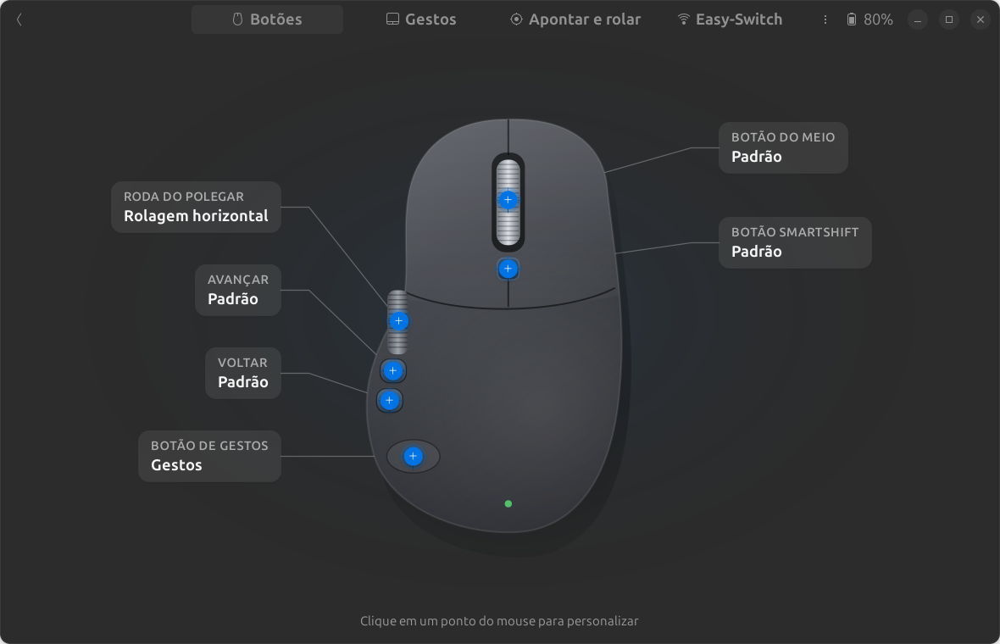
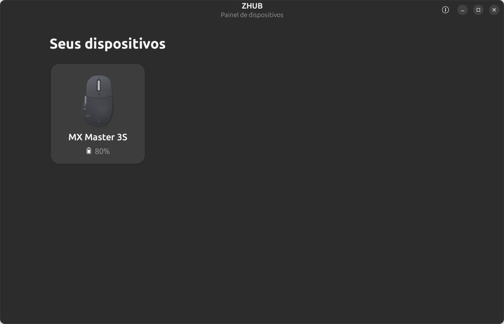
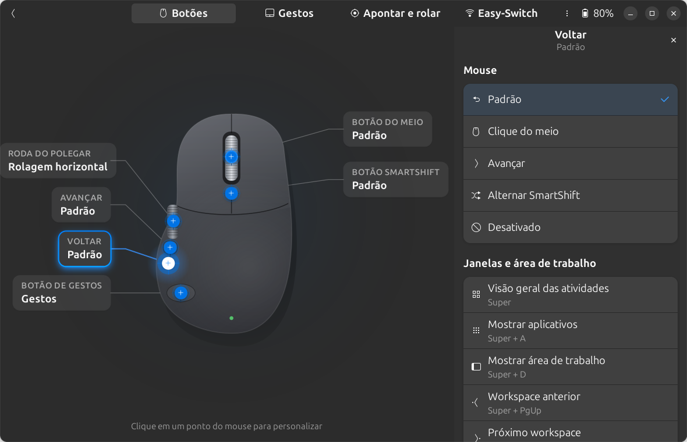
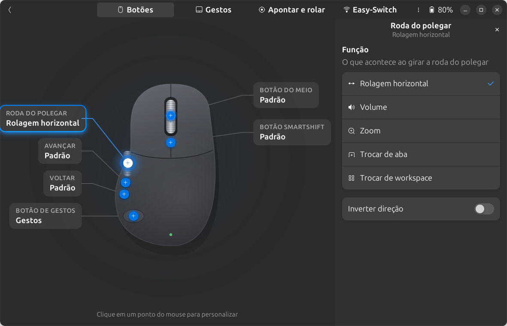
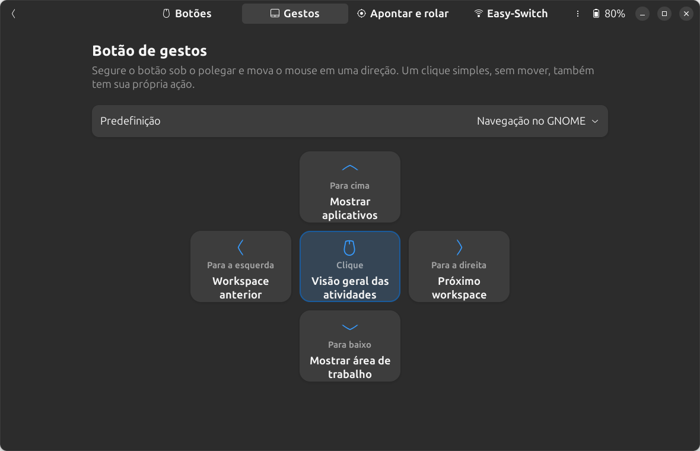
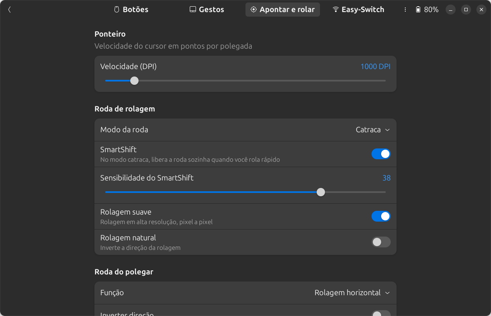
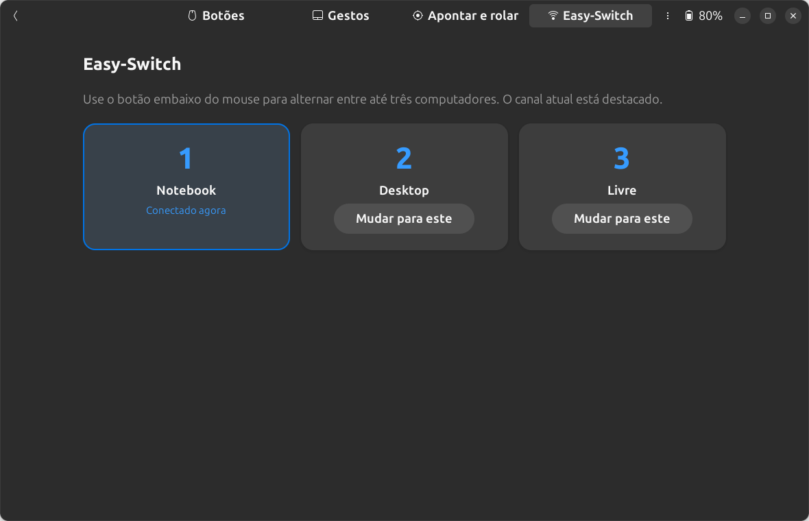

# ZHUB

Painel para personalizar mouses e teclados Logitech no Linux, com visual moderno
(GTK4 + libadwaita) e organização inspirada no Logi Options+.

> **Projeto não oficial.** O ZHUB é um fork do [Solaar](https://github.com/pwr-Solaar/Solaar)
> e não tem nenhuma afiliação com a Logitech. "Logitech", "MX Master" e "Logi" são marcas
> registradas dos seus donos.



## O que dá para fazer

- **Botões**: um desenho interativo do mouse com pontos clicáveis em cada botão. Você
  escolhe a ação num painel lateral: clique do meio, voltar/avançar, atalhos do GNOME,
  copiar/colar, controles de mídia, um **atalho de teclado gravado na hora** ou **um
  comando qualquer**.
- **Gestos**: editor visual em cruz para o botão de gestos (clique, cima, baixo,
  esquerda, direita), com predefinições (Navegação no GNOME, Mídia, Navegador, Janelas).
- **Roda do polegar**: rolagem horizontal, volume, zoom, trocar de aba ou de workspace.
- **Apontar e rolar**: DPI, SmartShift e sensibilidade, modo da roda, rolagem suave
  e natural.
- **Easy-Switch**: mostra os três canais e troca de computador.
- Outros dispositivos suportados pelo Solaar aparecem com as configurações genéricas.

Testado com o MX Master 3S via Bluetooth no Ubuntu 24.04 (GNOME, X11).

## Visual

**Seus dispositivos**: a tela inicial lista os mouses e teclados com bateria e status.



**Botões**: clique em um ponto do mouse e escolha a ação no painel lateral.



**Roda do polegar**: função e sensibilidade, direto no desenho do mouse.



**Gestos**: editor visual em cruz, com predefinições.



**Apontar e rolar**: DPI, modo da roda, SmartShift e rolagem.



**Easy-Switch**: os três canais e o computador conectado agora.



## Como funciona

```
 zhub (GTK4 + libadwaita)  ──D-Bus──▶  zhub-service (fork do Solaar, GTK3)
   painel de configuração               fala HID++ com os dispositivos,
   salva ~/.config/zhub/actions.yaml    aplica configurações e executa
                                        atalhos, gestos e comandos
```

- `lib/zhub/`: o painel novo (`app.py`, `pages.py`, `mouse_canvas.py`, `widgets.py`)
  e o catálogo de ações (`actions.py`), que é compartilhado com o serviço.
- `lib/solaar/dbus_service.py`: a interface D-Bus `io.github.zhub.Service1`.
- `lib/logitech_receiver/diversion.py`: as ações do ZHUB viram regras do Solaar com
  prioridade sobre o `~/.config/solaar/rules.yaml`, que continua funcionando para
  regras avançadas.

## Instalação (Ubuntu 24.04)

```bash
sudo apt install python3-gi python3-gi-cairo gir1.2-gtk-3.0 gir1.2-gtk-4.0 gir1.2-adw-1 \
  gir1.2-ayatanaappindicator3-0.1 gir1.2-notify-0.7 python3-dbus python3-evdev \
  python3-psutil python3-pyudev python3-xlib python3-yaml

git clone <este repositório> ~/zhub
sudo install -m644 ~/zhub/rules.d-uinput/42-logitech-unify-permissions.rules /etc/udev/rules.d/
sudo udevadm control --reload-rules && sudo udevadm trigger

ln -s ~/zhub/bin/zhub ~/.local/bin/zhub
ln -s ~/zhub/bin/zhub-service ~/.local/bin/zhub-service
```

Depois é só rodar `zhub`. O serviço sobe sozinho se não estiver rodando. Para iniciar
o serviço junto com o login, crie `~/.config/autostart/zhub-service.desktop` com
`Exec=zhub-service --window=hide`.

As configurações do dispositivo ficam em `~/.config/solaar/config.yaml` e as ações do
painel em `~/.config/zhub/actions.yaml`.

## Licença e créditos

GPL-2.0 ou posterior, como o Solaar original (veja `LICENSE.txt` e `COPYRIGHT`).
Todo o trabalho de comunicação com os dispositivos é do projeto
[Solaar](https://github.com/pwr-Solaar/Solaar) e seus colaboradores. O README original
está em [`README.solaar.md`](README.solaar.md).
